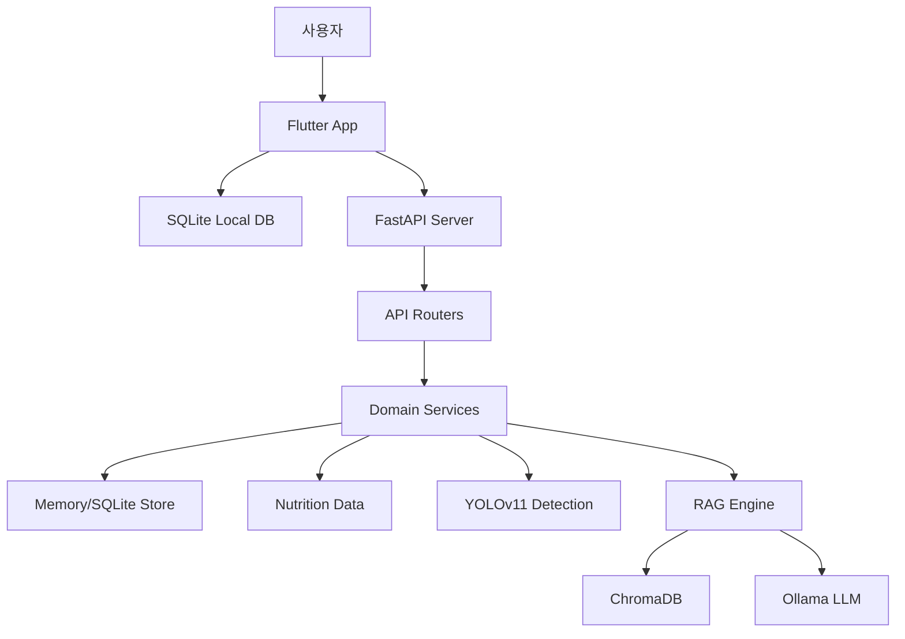

# NutrAI

> **Shoot for your health, NutrAI for your diet.**
> 식단 기록의 번거로움을 줄이고, 개인 맞춤형 영양 관리를 더 쉽게 만드는 AI 식단 관리 서비스입니다.

<div align="center">
  <br/>
  
</div>

---

## 목차

1. [프로젝트 소개](#프로젝트-소개)
2. [팀 소개](#팀-소개)
3. [주요 기능](#주요-기능)
4. [시스템 아키텍처](#시스템-아키텍처)
5. [기술 스택](#기술-스택)
6. [설치 및 실행](#설치-및-실행)
7. [프로젝트 구조](#프로젝트-구조)
8. [협업 규칙](#협업-규칙)

---

## 프로젝트 소개

NutrAI는 사용자가 매일 먹는 음식을 더 쉽게 기록하고, 기록된 식단을 바탕으로 영양 정보를 확인하며, 개인 건강 상태에 맞는 AI 피드백을 받을 수 있도록 돕는 서비스입니다.

### 해결하려는 문제

- 식단 관리는 꾸준한 기록이 중요하지만, 음식명과 영양 정보를 직접 입력하는 과정이 번거롭습니다.
- 사용자는 칼로리뿐 아니라 탄수화물, 단백질, 지방, 당류, 나트륨 등 건강 상태에 영향을 주는 정보를 함께 확인해야 합니다.
- 당뇨, 고혈압, 알레르기처럼 식단 제약이 있는 사용자는 일반적인 추천보다 개인화된 안내가 필요합니다.

### 제공하는 가치

- 사진 기반 음식 인식과 수동 입력을 함께 제공해 식단 기록 진입 장벽을 낮춥니다.
- 한국 식품 영양 데이터와 앱 내 기록을 연결해 사용자가 섭취량을 빠르게 확인할 수 있게 합니다.
- RAG 기반 AI 챗봇으로 사용자 프로필과 식단 기록을 반영한 맞춤형 영양 조언을 제공합니다.

---

## 팀 소개

**Team Moonshot**

| 이름 | 직책 | 역할 | 담당 업무 |
| :---: | :---: | :--- | :--- |
| **김영서** | 팀장 | App / PM | Flutter 앱 개발, UI/UX 설계, 전체 일정 관리 |
| **김서현** | 팀원 | BackEnd | FastAPI 서버 구축, DB 설계, API 명세서 작성 |
| **신동하** | 팀원 | AI / Data | YOLOv11 모델 학습, 영양 DB 전처리, RAG 엔진 최적화 |
| **이호연** | 팀원 | BackEnd | FastAPI 서버 구축, DB 설계, API 명세서 작성 |
| **최영수** | 팀원 | AI / Data | YOLOv11 모델 학습, 영양 DB 전처리, RAG 엔진 최적화 |

---

## 주요 기능

### 1. 사용자 온보딩 및 프로필 관리

- 사용자의 이름, 성별, 나이, 키, 몸무게 등 기본 정보를 등록합니다.
- 건강 목표와 개인 상태를 바탕으로 이후 추천과 챗봇 응답에 활용합니다.
- 앱 실행 시 기존 사용자 정보가 있으면 메인 화면으로, 없으면 온보딩 화면으로 이동합니다.

### 2. 식단 기록

- 아침, 점심, 저녁, 간식, 야식 단위로 식단을 기록합니다.
- 음식명, 칼로리, 탄수화물, 단백질, 지방 등 주요 영양 정보를 관리합니다.
- 로컬 SQLite 저장소를 통해 앱 내 기록을 유지합니다.

### 3. 음식 인식 및 영양 분석

- 이미지 기반 음식 탐지를 위한 YOLOv11 연동 구조를 제공합니다.
- 서버의 음식/영양 API를 통해 음식 데이터와 영양 정보를 조회합니다.
- 추후 모델 성능과 데이터셋 확장에 따라 자동 기록 정확도를 높일 수 있습니다.

### 4. 맞춤 추천

- 사용자 프로필과 식단 기록을 기반으로 추천 파이프라인을 실행합니다.
- 알레르기 및 건강 상태를 고려해 주의가 필요한 음식을 안내합니다.
- 추천 결과는 앱 화면과 서버 API 양쪽에서 검증 가능한 형태로 제공합니다.

### 5. AI 채팅

- FastAPI 서버와 RAG 엔진을 연결해 영양 상담형 챗봇을 제공합니다.
- LangChain, Ollama, ChromaDB 기반으로 영양 데이터 검색과 답변 생성을 수행합니다.
- 앱에서는 채팅 화면을 통해 사용자가 자연어로 질문할 수 있습니다.

---

## 시스템 아키텍처



---

## 기술 스택

### Frontend

- Flutter
- Dart
- Provider
- sqflite
- http
- image_picker

### Backend

- Python 3.11 권장
- FastAPI
- Uvicorn
- Pydantic
- httpx

### AI & Data

- YOLOv11
- LangChain
- LangChain Ollama
- ChromaDB
- Pandas
- 한국 식품 영양 데이터

### Tools

- Git / GitHub
- Figma
- Android Emulator

---

## 설치 및 실행

### 1. 프로젝트 클론

```bash
git clone https://github.com/nisdh2916/NutrAI.git
cd NutrAI
```

### 2. 백엔드 실행

Windows PowerShell 기준:

```powershell
python -m venv .venv
.\.venv\Scripts\Activate.ps1
pip install -r server/requirements.txt
python -m uvicorn server.main:app --host 0.0.0.0 --port 8000 --reload
```

서버 상태 확인:

```bash
curl http://127.0.0.1:8000/health
```

정상 응답 예시:

```json
{
  "status": "ok",
  "version": "0.1.0"
}
```

### 3. Android 에뮬레이터 포트 연결

앱이 Android 에뮬레이터에서 로컬 백엔드에 접근하려면 포트 리버스가 필요합니다.

```powershell
adb reverse tcp:8000 tcp:8000
```

프로젝트 루트의 `start.bat`을 실행하면 백엔드 실행과 `adb reverse`를 한 번에 처리할 수 있습니다.

### 4. Flutter 앱 실행

```bash
cd app
flutter pub get
flutter run
```

연결된 디바이스 확인:

```bash
flutter devices
```

### 5. 검증 명령

백엔드 테스트:

```bash
python -m pytest server/tests
```

Flutter 정적 분석 및 테스트:

```bash
cd app
flutter analyze
flutter test
```

---

## API 개요

서버는 `server/main.py`에서 다음 라우터를 등록합니다.

| 영역 | 설명 |
| :--- | :--- |
| `/health` | 서버 상태 확인 |
| `/detect` | 음식 이미지 탐지 |
| `/nutrition` | 영양 정보 조회 |
| `/meals` | 식단 기록 관리 |
| `/chat` | AI 채팅 |
| `/food` | 음식 추가 및 검색 |
| `/recommend` | 맞춤 추천 |
| `/profile` | 사용자 프로필 |

상세 요청/응답 구조는 `server/api/schemas.py`와 각 `server/api/routes_*.py` 파일을 기준으로 확인합니다.

---

## 프로젝트 구조

```plaintext
NutrAI/
├── app/                         # Flutter 앱
│   ├── android/                 # Android 설정
│   ├── ios/                     # iOS 설정
│   ├── lib/
│   │   ├── database/            # 로컬 SQLite 헬퍼
│   │   ├── models/              # 앱 데이터 모델
│   │   ├── providers/           # 앱 상태 관리
│   │   ├── repositories/        # 데이터 접근 계층
│   │   ├── screens/             # 주요 화면
│   │   ├── services/            # 서버 통신 서비스
│   │   ├── theme/               # 앱 테마
│   │   └── utils/               # 알레르기 검사, 채팅 파서 등
│   └── pubspec.yaml
├── server/                      # FastAPI 백엔드
│   ├── api/                     # API 라우터와 스키마
│   ├── db/                      # 메모리/SQLite 저장소
│   ├── scripts/                 # 스모크 테스트 및 검증 스크립트
│   ├── services/                # 탐지, 식단, 영양, 추천 서비스
│   ├── tests/                   # 백엔드 테스트
│   ├── main.py                  # FastAPI 앱 진입점
│   └── requirements.txt
├── ai/                          # AI 및 RAG 로직
│   ├── models/                  # 모델 파일 위치
│   ├── rag_engine/              # RAG 파이프라인과 영양 데이터
│   └── scripts/                 # 데이터 구축/추가 스크립트
├── data/                        # 영양 DB 및 데이터셋
├── docs/                        # 설계, 진행 상황, 트러블슈팅 문서
├── SQL/                         # SQL 관련 자료
├── start.bat                    # Windows 개발 실행 보조 스크립트
└── README.md
```

---

## 협업 규칙

### 커밋 메시지

`태그: 변경 내용` 형식을 사용합니다.

| 태그 | 의미 |
| :--- | :--- |
| `feat` | 새로운 기능 추가 |
| `fix` | 버그 수정 |
| `docs` | 문서 수정 |
| `design` | UI 디자인 변경 |
| `chore` | 빌드, 설정, 패키지 작업 |
| `refactor` | 동작 변경 없는 코드 구조 개선 |
| `test` | 테스트 추가 또는 수정 |

커밋 메시지에는 `Co-Authored-By: Codex`를 추가하지 않습니다.

### 브랜치

기본 브랜치:

- `main`: 안정 버전 기준 브랜치
- `feat/*`: 기능 개발 브랜치
- `fix/*`: 버그 수정 브랜치
- `docs/*`: 문서 수정 브랜치

팀원별 시작 브랜치:

- `team/kim-youngseo`
- `team/kim-seohyeon`
- `team/shin-dongha`
- `team/lee-hoyeon`
- `team/choi-youngsu`

### 문서화

- 구조 변경이나 주요 결정은 `docs/architecture.md`, `docs/progress.md` 등에 기록합니다.
- 버그를 수정한 경우 `docs/troubleshooting.md`에 증상, 원인, 해결, 관련 파일을 남깁니다.
- API 계약이나 추천 파이프라인을 바꾼 경우 관련 테스트 또는 스모크 스크립트도 함께 확인합니다.

---

<div align="center">
Copyright © 2026 <b>Team Moonshot</b>. All rights reserved.
</div>
