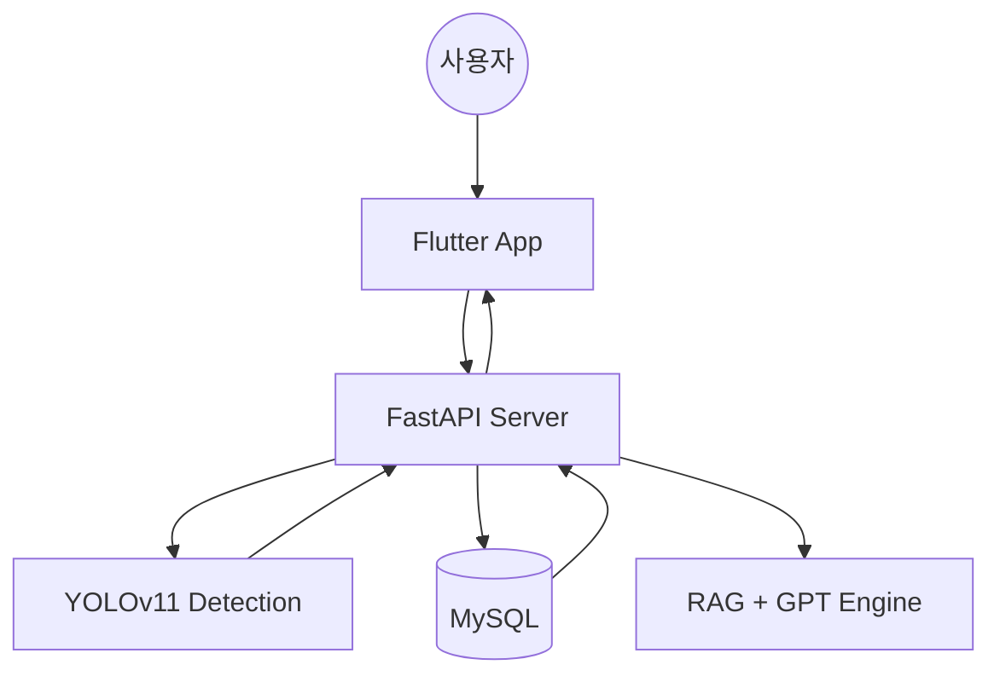

#  NutrAI (nutrition + AI)
> **Shoot for your health, Moonshot for your diet.**
> 
> **"불가능해 보이는 식단 기록의 자동화, NutrAI가 현실로 만듭니다."**

<div align="center">
  <br/>
  
</div>

---

##  목차
1. [팀 소개](#-팀-소개)
2. [프로젝트 소개](#-프로젝트-소개)
3. [주요 기능](#-주요-기능)
4. [기술 스택](#-기술-스택)
5. [시스템 아키텍처](#-시스템-아키텍처)
6. [협업 컨벤션](#-협업-컨벤션)
7. [설치 및 실행 방법](#-설치-및-실행-방법)

---

## 팀 소개 (Team Moonshot)

| 이름 | 직책 | 역할 | 담당 업무 |
| :---: | :---: | :--- | :--- |
| **김영서** | 팀장 | **App / PM** | Flutter 앱 개발, UI/UX 설계, 전체 일정 관리 |
| **김서연** | 팀원 | **BackEnd** | FastAPI 서버 구축, DB 설계, API 명세서 작성 |
| **신동하** | 팀원 | **AI / Data** | YOLOv11 모델 학습, 영양 DB 전처리, RAG 엔진 최적화 |
| **이호연** | 팀원 | **BackEnd** | FastAPI 서버 구축, DB 설계, API 명세서 작성 |
| **최영수** | 팀원 | **AI / Data** | YOLOv11 모델 학습, 영양 DB 전처리, RAG 엔진 최적화 |
---

##  프로젝트 소개

### 1. 기획 배경
- **현대인의 페르소나**: 기록이 귀찮아 식단 관리를 포기하는 다이어터, 당뇨 환자.
- **기존의 한계**: 수기 입력의 번거로움과 정확도 낮은 영양 정보.
- **우리의 목표**: 사진 한 장으로 끝내는 **자동 기록**과 개인 맞춤형 **AI 피드백**.

### 2. 주요 타겟
- 식단 관리가 생존인 **만성질환자**
- 체계적인 영양 섭취를 원하는 **헬스 및 자기관리형 사용자**

---

##  주요 기능 (Features)

<details>
<summary><b> AI 식단 자동 기록 (Smart Capture)</b></summary>
<br/>

- **YOLOv11** 객체 탐지 기술을 이용해 사진 속 음식 종류와 개수를 자동 인식.
- 한국식품영양성분표 DB와 연동하여 칼로리 및 탄단지 즉시 분석.
</details>

<details>
<summary><b> 지능형 대시보드 (Dashboard)</b></summary>
<br/>

- 오늘 남은 권장 섭취량 시각화.
- 일별/주별 기록 추이를 통한 건강 상태 트래킹.
</details>

<details>
<summary><b> 맞춤형 AI 코칭 (RAG Engine)</b></summary>
<br/>

- 사용자 건강 데이터(키, 몸무게, 활동량) 기반 맞춤 영양 가이드.
- **RAG(검색 증강 생성)**를 통해 최신 영양학 근거에 기반한 챗봇 답변 제공.
</details>

---

## 🛠 기술 스택

###  Frontend
<p align="left">
  
  
</p>

###  Backend
<p align="left">
  
  
  
</p>

###  AI & Data
<p align="left">
  
  
  
</p>

###  DevOps & Tools
<p align="left">
  
  
  
</p>

---

##  시스템 아키텍처




## 🤝 협업 컨벤션 (Convention)

<details>
<summary><b>📌 Git Commit Message 규칙</b></summary>
<br/>

> **"태그: 상세 내용"** 형식을 준수합니다. (예: `feat: 로그인 기능 추가`)

| 태그 | 의미 |
| :--- | :--- |
| `feat` | 새로운 기능 추가 |
| `fix` | 버그 수정 |
| `docs` | 문서 수정 (README 등) |
| `design` | UI 디자인 변경 |
| `chore` | 빌드 업무, 패키지 설정 수정 |
| `refactor` | 코드 리팩토링 |
</details>

<details>
<summary><b>🌿 Branch 전략</b></summary>
<br/>

- `main`: 배포 가능한 최종 코드
- `develop`: 개발 중인 코드들이 모이는 곳
- `feat/app`: 앱 관련 기능 개발 (동하)
- `feat/server`: 서버 API 개발
- `feat/ai`: AI 모델 학습 및 데이터 처리
</details>

---

## 🏃 설치 및 실행 방법 (Installation)

### 1. 프로젝트 클론
```bash
git clone https://github.com/nisdh2916/NutrAI.git
cd NutrAI
```

### 2. Frontend (Flutter) 실행
```Bash
cd app
flutter pub get
flutter run
```
### 3. Backend (FastAPI) 실행

#### macOS / Linux (bash, zsh)
```bash
# 프로젝트 루트(NutrAI/)에서 실행
python -m venv .venv
source .venv/bin/activate
pip install -r server/requirements.txt
uvicorn server.main:app --reload
```

#### Windows PowerShell
```powershell
# 프로젝트 루트(NutrAI/)에서 실행
python -m venv .venv
.\.venv\Scripts\Activate.ps1
pip install -r server/requirements.txt
uvicorn server.main:app --reload
```
> PowerShell에서 실행 정책 오류가 나면: `Set-ExecutionPolicy -Scope Process -ExecutionPolicy Bypass`

#### Windows CMD
```cmd
python -m venv .venv
.venv\Scripts\activate.bat
pip install -r server/requirements.txt
uvicorn server.main:app --reload
```

### 4. API 동작 확인
```bash
curl http://127.0.0.1:8000/health
```

### 📂 프로젝트 구조
```Plaintext
NutrAI/
├── .github/                # GitHub Actions CI/CD 워크플로우
├── app/                    # Flutter 프론트엔드 (Dart)
│   ├── android/            # 안드로이드 네이티브 설정
│   ├── ios/                # iOS 네이티브 설정
│   ├── lib/
│   │   ├── core/           # 공통 유틸, 테마, 라우터
│   │   ├── features/       # 기능별 모듈 (촬영, 분석, 추천, 리포트)
│   │   ├── models/         # 데이터 모델 (User, Meal 등)
│   │   └── data/           # SQLite 로컬 캐시 처리
│   └── pubspec.yaml        # Flutter 패키지 관리
├── server/                 # FastAPI 백엔드 (Python)
│   ├── api/                # API 엔드포인트 (/chat, /detect 등) 
│   ├── core/               # 인증(JWT) 및 서버 설정
│   ├── db/                 # MySQL 연결 및 ORM 설정
│   ├── services/           # 비즈니스 로직 (영양 분석, 추천 알고리즘)
│   └── requirements.txt    # 서버 라이브러리 목록
├── ai/                     # AI 모델 및 추론 로직
│   ├── models/             # YOLOv11 가중치 파일 (.pt, .tflite)
│   ├── scripts/            # 모델 학습 및 데이터 전처리 스크립트
│   └── rag_engine/         # GPT-OSS + RAG 관련 프롬프트 및 벡터 DB
├── docs/                   # 기획서, 보고서 및 테스트 케이스
│   ├── planning/           # 아이디어 기획서 및 시스템 설계서
│   ├── designs/            # 피그마(Figma) 링크 및 UI 설계도
│   ├── test_cases/         # 단위/통합 테스트 명세서 (TC-MealLog-01 등)
│   └── img/                # 문서용 이미지 폴더
├── data/                   # 데이터셋 및 영양 DB
│   ├── dataset/            # 한국 음식 이미지 샘플 (라벨링 데이터)
│   └── nutrition_db/       # 한국식품영양성분표(KFDA) CSV/SQL
├── .gitignore              # 깃 제외 목록 (API Key, 가상환경 등) 
└── README.md               # 프로젝트 메인 대문
```

<div align="center">
Copyright © 2026 <b>Team Moonshot</b>. All rights reserved.
</div>
