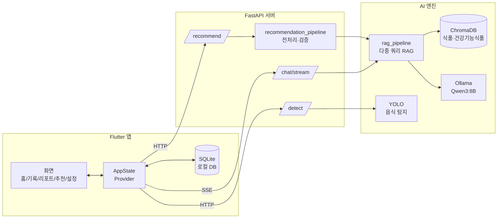
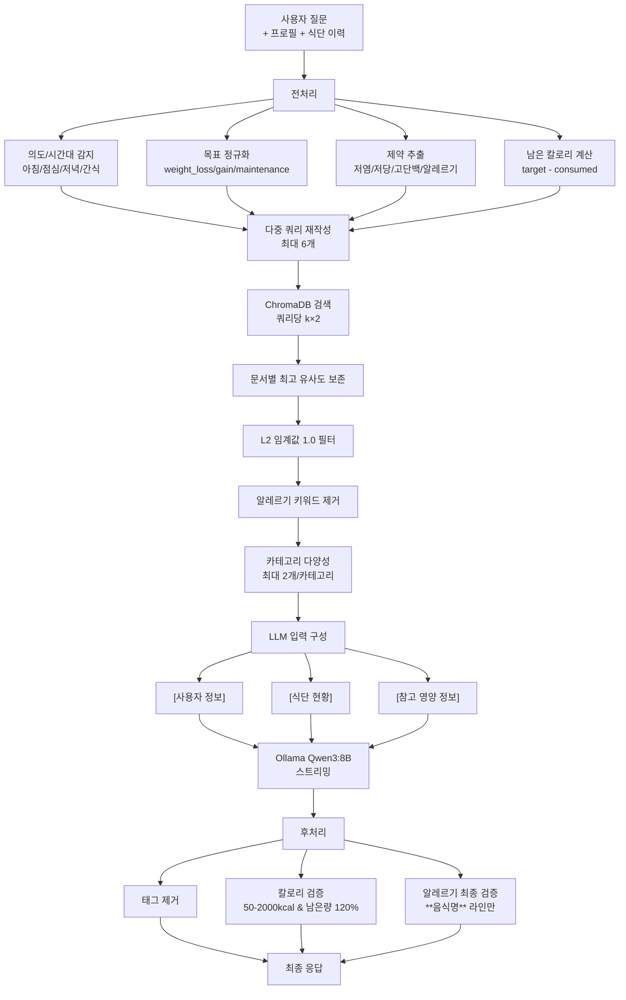
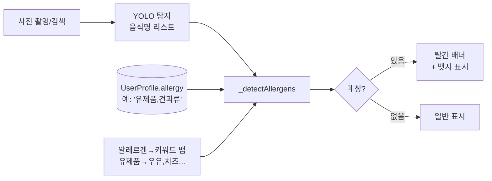
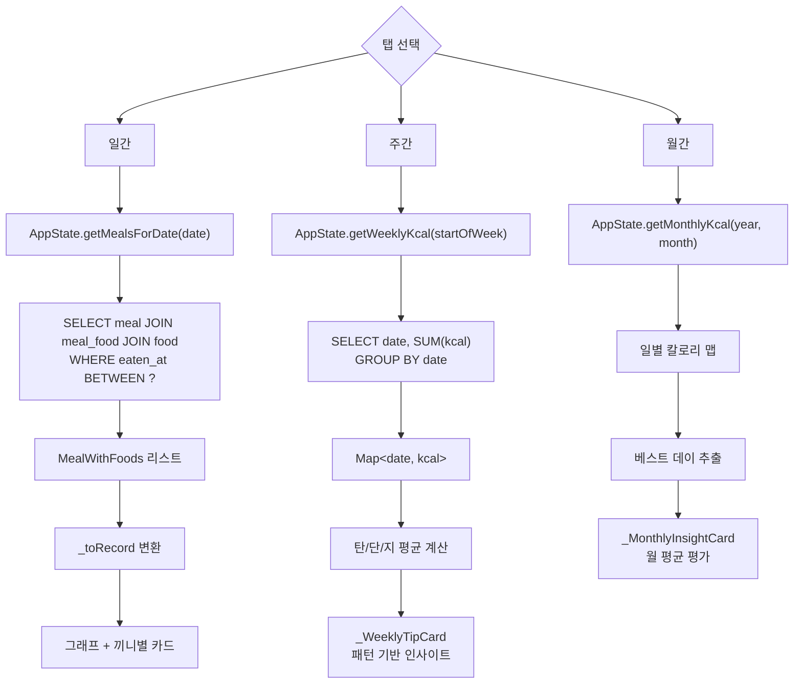
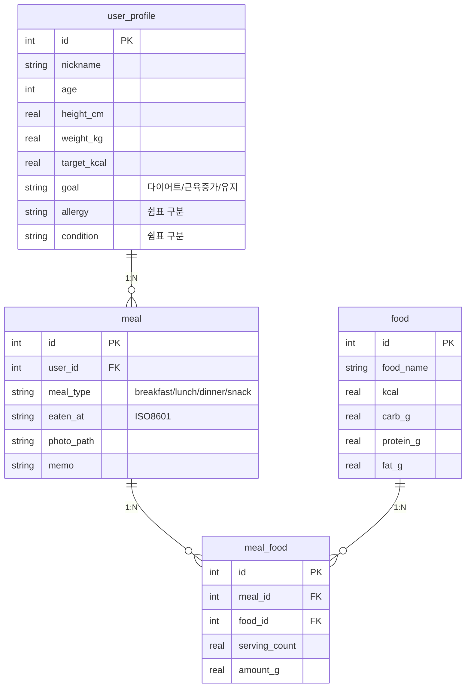

# NutrAI 시스템 아키텍처

캡스톤 발표용 기술 문서. 데이터 흐름·알고리즘·핵심 의사결정 정리.

---

## 1. 전체 시스템 구조

**계층 분리 원칙**
- Flutter는 로컬 SQLite를 truth source로 사용 → 오프라인에서도 식사 기록·리포트 동작
- 서버는 stateless. 추천/탐지 호출 시 사용자 프로필·식단 이력을 요청 본문으로 전달
- AI 엔진은 서버에 임베드(서비스 레이어). 외부 API 호출 없음 → 비용/프라이버시 이점

---

## 2. RAG 추천 파이프라인

`POST /api/recommend` 호출 시 실행되는 파이프라인. 핵심 파일: [server/services/recommendation_pipeline.py](../server/services/recommendation_pipeline.py), [ai/rag_engine/rag_pipeline.py](../ai/rag_engine/rag_pipeline.py).

**왜 다중 쿼리인가?** 단일 쿼리는 사용자 질문(예: "점심 추천")만 검색해 목표·제약·이력을 무시함. 다중 쿼리(`체중 감량 점심 메뉴 추천` + `남은 칼로리 800kcal 이하 점심 식사` + `당뇨 맞춤 식단` 등)로 결과를 합치면 컨텍스트 적합도가 크게 올라감.

**왜 알레르기 이중 검증인가?**
1. 검색 단계에서 키워드 매칭으로 후보 제거 (`_has_allergen` in [rag_pipeline.py:258](../ai/rag_engine/rag_pipeline.py#L258))
2. LLM 응답 후처리에서 `**음식명**` 라인만 재검사 (`_build_allergen_warning` in [rag_pipeline.py:461](../ai/rag_engine/rag_pipeline.py#L461))

LLM이 컨텍스트를 무시하고 환각을 일으켜도 사용자 화면에는 경고 배너가 추가됨. 코칭 메시지에서 알레르기를 *언급*하는 것은 정상이므로 음식명 라인만 검사함.

---

## 3. 알레르기 경고 흐름 (앱 측)

`food_add_screen.dart`에서 사진 분석/검색 결과에 알레르기 매칭. 핵심 파일: [app/lib/screens/food_add_screen.dart](../app/lib/screens/food_add_screen.dart).

**3-tier 검증 (서버 측과 합치면)**
| 단계 | 위치 | 역할 |
|---|---|---|
| 1. RAG 검색 필터 | `_retrieve_multi` | 알레르기 음식이 LLM에 안 들어가게 |
| 2. LLM 응답 검증 | `_build_allergen_warning` | LLM 환각 방지 |
| 3. 앱 표시 검증 | `_detectAllergens` | 사용자가 직접 등록할 때 경고 |

---

## 4. 일/주/월 리포트 데이터 흐름

핵심 파일: [app/lib/screens/report_screen.dart](../app/lib/screens/report_screen.dart), [app/lib/repositories/meal_repository.dart](../app/lib/repositories/meal_repository.dart).

**왜 인사이트를 클라이언트에서 계산하나?** LLM 호출 없이도 즉시 표시 가능. 영양소 평균·베스트 데이는 결정론적 규칙(평균 ± 표준편차, 칼로리 ≤ 목표)이라 ML이 불필요.

---

## 5. 데이터 모델 (SQLite)

**정규화 결정**
- `food`를 별도 테이블로 분리 → 동일 음식 재사용, 식품 DB 마스터 데이터로 활용
- `meal_food.serving_count`로 양 표현 → 영양소 = food 값 × serving_count (`MealFoodJoin.totalKcal` 등)

---

## 6. 핵심 의사결정 요약

| 항목 | 선택 | 이유 |
|---|---|---|
| 임베딩 모델 | KR-SBERT (snunlp) | 한국어 음식명/영양 텍스트에 특화 |
| LLM | Qwen3:8B (Ollama) | 로컬 추론 → 비용 0, 프라이버시, 한국어 양호 |
| 벡터 DB | ChromaDB | 로컬 파일 기반, 서버 추가 인프라 불필요 |
| 클라이언트 DB | SQLite | 오프라인 동작, 식단 기록은 동기화 비필수 |
| 알레르기 검증 | 3중 (검색·응답·앱) | LLM 환각 방어 + 사용자 직접 입력 보호 |
| 추천 쿼리 | 다중 (최대 6개) | 단일 쿼리는 컨텍스트 부족 |
| 후처리 | think 제거·칼로리·알레르기 | Qwen3 CoT 잔여물 + 안전성 |
